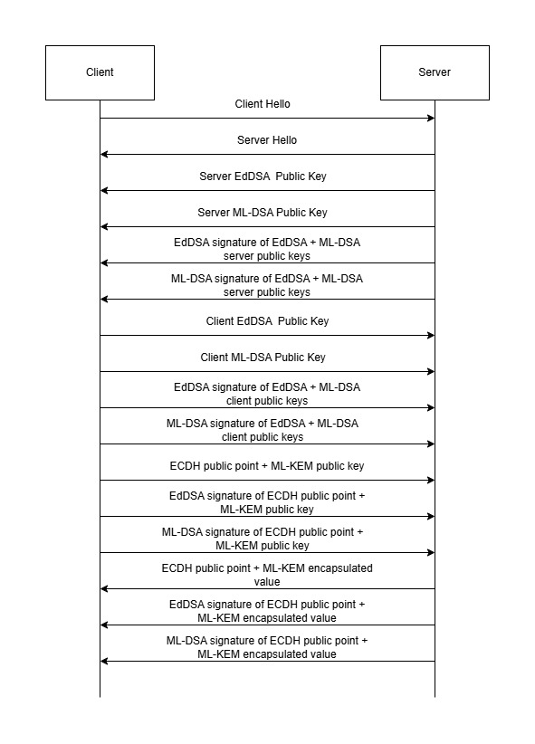

# Hybrid Encryption Method: pqchybrid

## Overview
This project implements a Hybrid Encryption Method that combines classical cryptographic techniques with post-quantum cryptographic methods to provide secure data transmission in light of potential quantum computing threats.

## Features
The algorithms used are EdDSA with Ed25519, ML-DSA-6x5, ML-KEM-768 and ECDH with x25519. 

## Requirements
- Python 3.8 or higher

## Installation
1. Clone this repository: git clone https://github.com//pqchybrid.git
2. Navigate to the project directory: cd pqchybrid
3. To start the PQC communication channel: run main.py 
